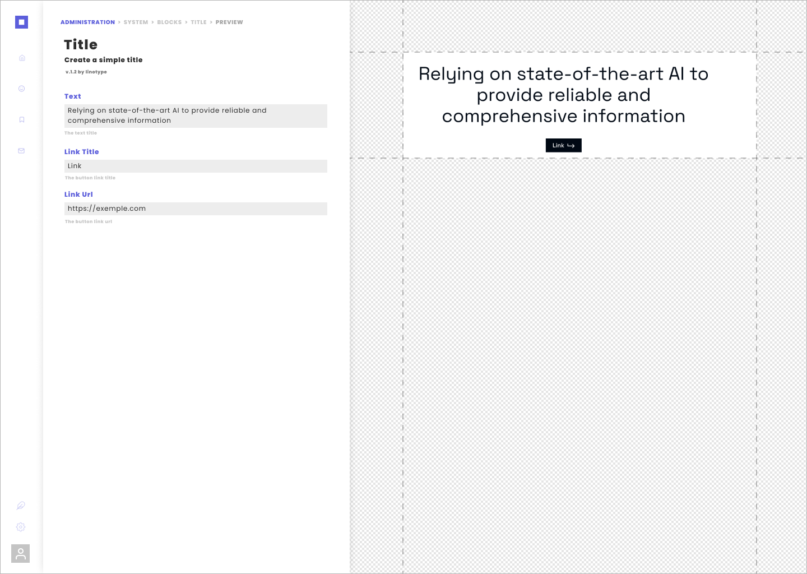

# Introduction

**linotype** \| a light monolith

Linotype is a **Content Management Frameworks** based on **atomic design system** and driven by **yaml configuration** files with **auto-generated backend**

Code **blocks**, **fields** and **services.** Create **modules** and **templates** with them. Map everything in **themes.**

Your **linotype** **projects** can be plugged into [**Symfony**](install/symfony.md)**,** [**Drupal**](install/drupal.md)**,** [**Wordpress**](install/wordpress.md) or simply be used as [**standalone**](install/standalone.md).




**Linotype is written in PHP**. Following the evolution of web development and specially the [react server-side components](https://reactjs.org/blog/2020/12/21/data-fetching-with-react-server-components.html)**,** a linotype rewriting in **javascript** on the **react framework** is under study. The react server components are in research and development, **linotype** still has many years ahead in this version. **PHP is not dead ;\)** 


The linotype admin interface for symfony is under development. Take a look at [mockup](environement/symfony/admin.md)

